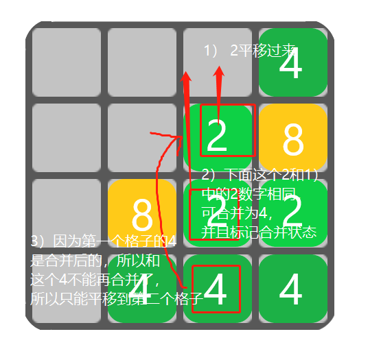

# phaser-2048

2048游戏


技术栈：

- vue3
- ts
- vite
- phaser.js
- tailwind

## Project Setup

```sh
npm install
```

### Compile and Hot-Reload for Development

```sh
npm run dev
```

### Type-Check, Compile and Minify for Production

```sh
npm run build
```

### Run Unit Tests with [Vitest](https://vitest.dev/)

```sh
npm run test:unit
```

### Lint with [ESLint](https://eslint.org/)

```sh
npm run lint
```

## 游戏思路

1. 创建4 \* 4的格子，每个格子记录位置(x,y)、行和列、数字、是否被占用、对应的方块（Phaser.GameObjects.Image）等属性

2. 初始先随机创建两个方块，并将方块挂到对应的格子上

3. 移动&合并

   1. 监听鼠标按下后抬起，计算鼠标移动距离，如果横向距离较大，则横向移动，否则纵向移动，再细分成上下左右四个方向，不同方向对应移动逻辑稍有不同

   - 上移：每一列从上到下遍历，该合并合并，该平移平移

     例如：遍历到第一列时，occupiedGrid先指向第一个格子(0, 0)，然后遍历下面的格子：指向(0, 1)，判断item是否被占用，如果没占用则item指向(0, 2)，继续判断；如果item被占用，则判断occupiedGrid与item：（1）数字相同且occupiedGrid当前这轮遍历没有被合并过，则两者合并；（2）否则，如果occupiedGrid与item中间隔了空格子，则将item平移到occupiedGrid空着或occupiedGrid下一个空着的位置

     
     

     例：遍历到第三列上移：
     

   - 下移：每一列从下到上遍历
   - 左移：每一行从左到右遍历
   - 右移：每一行从右到左遍历

   2. 监听上下左右四个键盘按下，对应移动同1.

4. 当不能再生成新格子（没有空格子）则游戏结束

[主要代码](./src/scene/game.ts)
